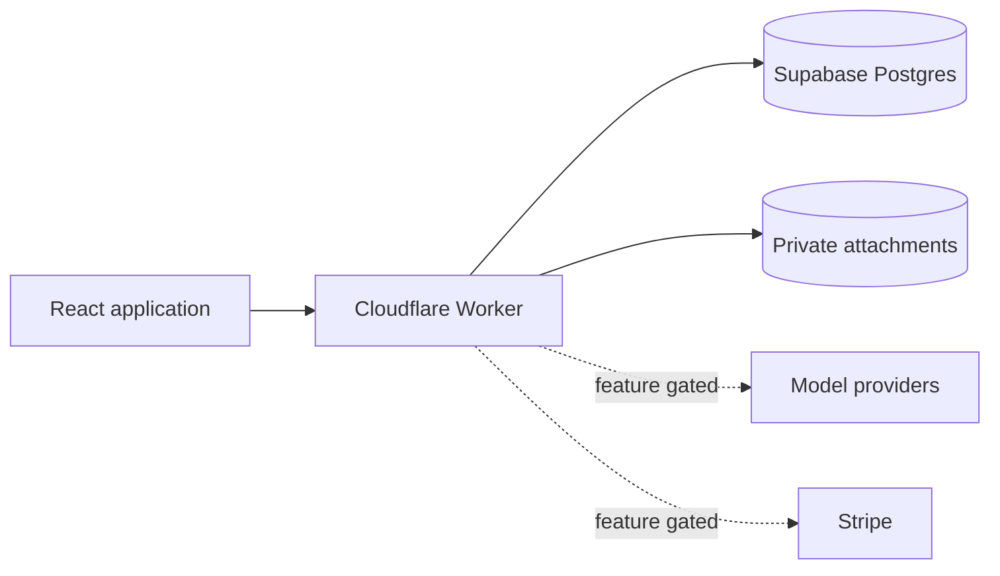

<p align="center">
  <a href="https://woolgathering.app" aria-label="Open woolgather">
    
  </a>
</p>

<h1 align="center">woolgather</h1>

<p align="center">
  <strong>Your ideas. Coming together.</strong><br>
  A calm workspace for turning rough ideas into durable, understandable projects.
</p>

<p align="center">
  <a href="https://woolgathering.app"></a>
  <a href="https://github.com/juztripper/woolgather/actions/workflows/ci.yml"></a>
  <a href="LICENSE"></a>
  
  
</p>

<p align="center">
  
</p>

## What is woolgather?

Most ideas begin as fragments: a sentence, a reference, a question, or something that is difficult to explain yet. woolgather gives those fragments room to develop without forcing them into a rigid specification too early.

Write freely in **Ideas**, bring an idea into a **Project**, discuss it in persistent **Chats**, work with focused **Agents**, collect private **Sources**, and keep the meaning that matters in a structured **Plan**. Authored intent, suggestions, evidence, decisions, and open questions remain visibly distinct.

The public application is available at **[woolgathering.app](https://woolgathering.app)**.

## Highlights

- **Intervention-free Ideas** — a durable block document with attachments, recovery, export, and project handoff.
- **Conversation-first Projects** — persistent chats with independent drafts and deliberate project context.
- **Inspectable planning** — keep, revise, connect, or reject proposed changes instead of silently rewriting intent.
- **Agents and Sources** — bring focused perspectives and private reference material into a project when useful.
- **Recovery by design** — optimistic concurrency, idempotent commands, retry receipts, and explicit conflict handling.
- **Local-first development** — the complete automated suite runs without paid model calls.
- **Accessible interaction** — keyboard navigation, reduced-motion support, responsive layouts, and restrained focus treatment.

## Technology

<p>
  
  
  
  
  
</p>

| Layer   | Technology                                               | Responsibility                                                                    |
| ------- | -------------------------------------------------------- | --------------------------------------------------------------------------------- |
| Web     | React, TypeScript, Vite, Tailwind CSS                    | Editor, library, projects, account surfaces, and public pages                     |
| API     | Cloudflare Workers and Durable Objects                   | Authenticated commands, streaming assistance, voice sessions, and static delivery |
| Data    | Supabase Postgres, Auth, Storage, and Row Level Security | Canonical state, ownership boundaries, attachments, and transactional recovery    |
| Domain  | Runtime-independent TypeScript packages                  | Shared contracts, validation, exports, and project semantics                      |
| Billing | Stripe, disabled unless explicitly configured            | Checkout, portal access, webhooks, and allowance reconciliation                   |



## Repository layout

```text
apps/
  web/                 React application and public assets
  api/                 Cloudflare Worker and Durable Objects
packages/
  domain/              Shared domain contracts and exports
supabase/
  migrations/          Canonical schema and security policies
  functions/           Private attachment transport
scripts/               Public build and offline test harness
tests/                 Unit, integration, security, and recovery tests
```

Internal product documents, research, provider traces, launch material, recordings, agent instructions, and media-production tooling are intentionally not part of the public repository.

## Local development

### Requirements

- Node.js 24
- npm 11 or newer
- PostgreSQL client and server tools for the test suite
- A Supabase project for authenticated application development

### Setup

```bash
git clone https://github.com/juztripper/woolgather.git
cd woolgather
npm ci
cp .dev.vars.example .dev.vars
npm run dev
```

Open [http://localhost:4200](http://localhost:4200). Configure the Supabase URL and publishable key in `.dev.vars`; never place service-role keys or provider secrets in browser-visible configuration.

AI assistance, voice, allowances, and billing all fail closed. Their example flags are `false`, and ordinary local development requires no paid provider call.

## Checks

```bash
npm run check:format   # formatting
npm run build          # UI guards, TypeScript, and production bundle
npm test               # disposable Postgres, migrations, tests, restart, and restore
npm run deploy:check   # Cloudflare dry run after a successful build
```

`npm test` creates an ephemeral loopback-only PostgreSQL cluster, applies every migration, runs the test suite, verifies semantic data across restart, and restores a logical backup into an empty database. Set `PG_BIN` when PostgreSQL tools are not discoverable through `pg_config`.

## Configuration and security

- Copy `.dev.vars.example`; never commit `.dev.vars` or `.env` files.
- Use only a Supabase publishable key in client-accessible configuration.
- Keep service credentials in the deployment provider's encrypted secret store.
- Enable paid or externally connected features only after configuring their complete security and accounting boundary.
- Use synthetic identities and data for development and automated checks.

Please report vulnerabilities privately as described in [SECURITY.md](SECURITY.md).

## Contributing

The public source is available for inspection, learning, and thoughtful contributions. Please read [CONTRIBUTING.md](CONTRIBUTING.md) before opening a pull request. Product direction and feature activation remain maintainer decisions.

## License

woolgather is licensed under the **GNU Affero General Public License v3.0 only**. See [LICENSE](LICENSE).

Bundled fonts, provider marks, generated artwork, and third-party packages retain their respective terms. See [THIRD_PARTY_NOTICES.md](THIRD_PARTY_NOTICES.md).

---

<p align="center">
  Made with care by <a href="https://rippersgames.com">Ripper's Games</a>.
</p>
